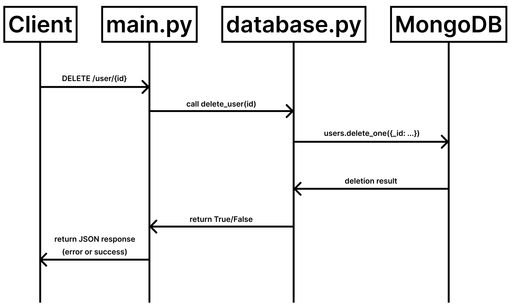

# Delete Microservice (FastAPI + MongoDB)

## 1. Overview

This microservice allows deletion of users, projects, and subtasks stored
in a MongoDB collection via a unified `DELETE /deletion` endpoint.
It is implemented using FastAPI and uses `pymongo` for direct access to MongoDB.

## 2. Setup Instructions

Install dependencies:

```bash
pip install -r requirements.txt
```

Run the microservice:

```bash
uvicorn main:app --reload
```

Setup database with known test user (optional):

```bash
python test/setup_user.py
```

## 3. Request Formatting

Endpoint:

```bash
DELETE /deletion
```

Required Header:

```sql
x-user-email: <email of the user to delete or modify>
```

### Request Body Formats:

Subtask:

```json
{
  "project-type": "current",
  "project-name": "Current Project",
  "task-index": 0
}
```

Project:

```json
{
  "project-type": "planned",
  "project-name": "Planned Project"
}
```

User:

```json
# No body required, only the x-user-email header is needed
```

## 4. Response Formatting

If successful:

```json
{
  "status": "success",
  "message": "Project 'Planned Project' deleted from planned"
}
```

If user/project/task is not found:

```json
{
  "detail": "Project not found"
}
```

If the request is missing required data:

```json
{
  "detail": "Missing project type or name for subtask deletion"
}
```

## 5. UML Sequence Diagram



## 6. Notes

- MongoDB must be running locally on localhost:27017

- Use MongoDB Compass to browse or verify data

- This service does not use session cookies or authentication, instead it relies on the x-user-email header for identification
