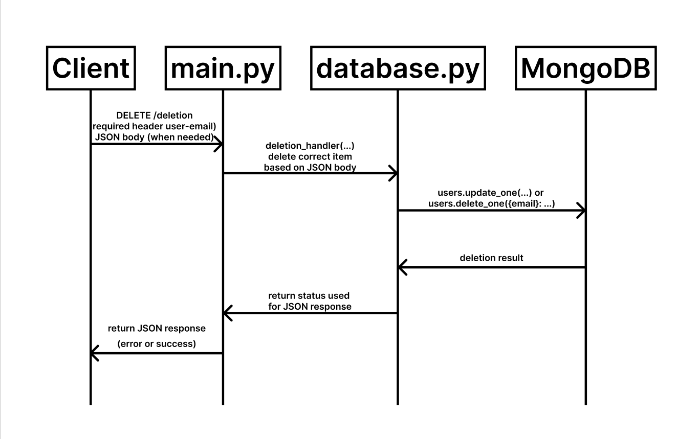

# Delete Microservice (FastAPI + MongoDB)

## 1. Overview

This microservice deletes users, projects, and subtasks from a MongoDB database via HTTP DELETE requests.
It is implemented using FastAPI and uses pymongo for direct database access.

## 2. Setup Instructions

Install dependencies and run the microservice:

```bash
pip install -r requirements.txt
uvicorn main:app --reload
```

## 3. Configuration

Edit database.py:

- DATABASE_NAME: your MongoDB database name

- USER_COLLECTION, PROJECT_COLLECTION, SUBTASK_COLLECTION: your actual collection names

- USE_OBJECT_ID: set to False if your \_id fields are strings (not MongoDB ObjectId)

## 4. Communication Contract

### 4.1 How to Programmatically Request Data

To delete a document, send an HTTP DELETE request to one of the following endpoints:

```http
DELETE /user/{user_id}
DELETE /project/{project_id}
DELETE /subtask/{subtask_id}
```

#### Required Headers:

```http
Authorization: Bearer faketoken123
```

#### Example Python Request:

```python
import requests

BASE = "http://localhost:8000"
HEADERS = {"Authorization": "Bearer faketoken123"}
response = requests.delete(f"{BASE}/user/665f123abc...", headers=HEADERS)
print(response.json())
```

### 4.2 How to Programmatically Receive Data

The service will respond with a JSON object.

If successful:

```json
{
  "status": "success",
  "message": "User 665f123abc... has been permanently deleted."
}
```

If the item does not exist:

```json
{
  "detail": "User not found."
}
```

## 5. UML Sequence Diagram



## 6. Notes

- MongoDB must be running locally on localhost:27017

- Use MongoDB Compass to browse or verify data

- To test the microservice end-to-end, run:

```bash
python test_delete.py
```
